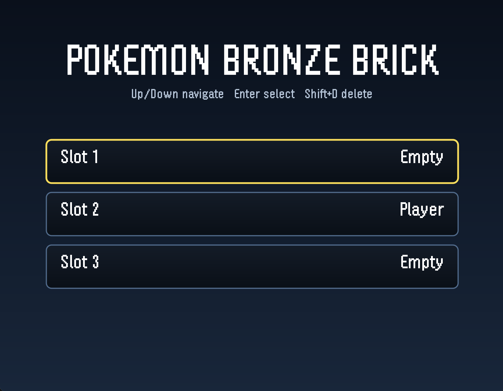
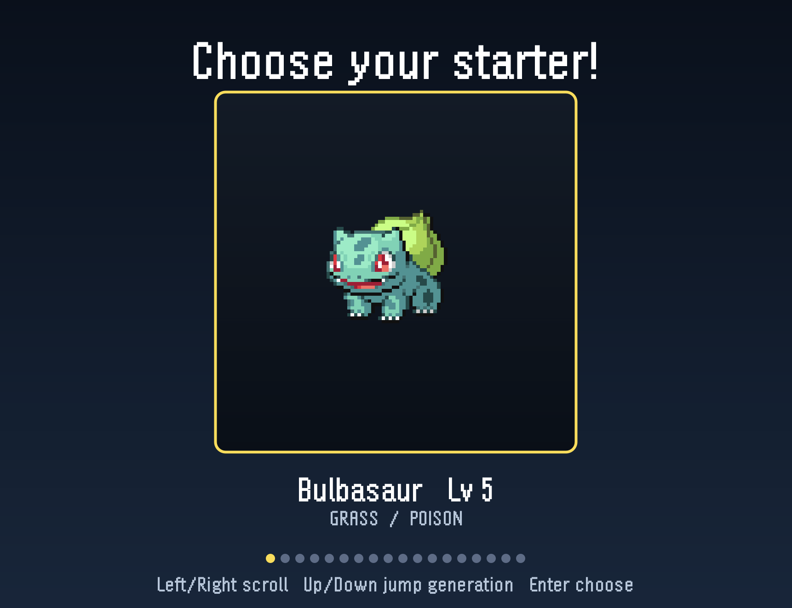
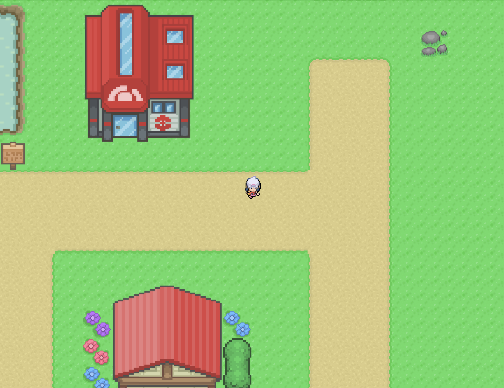
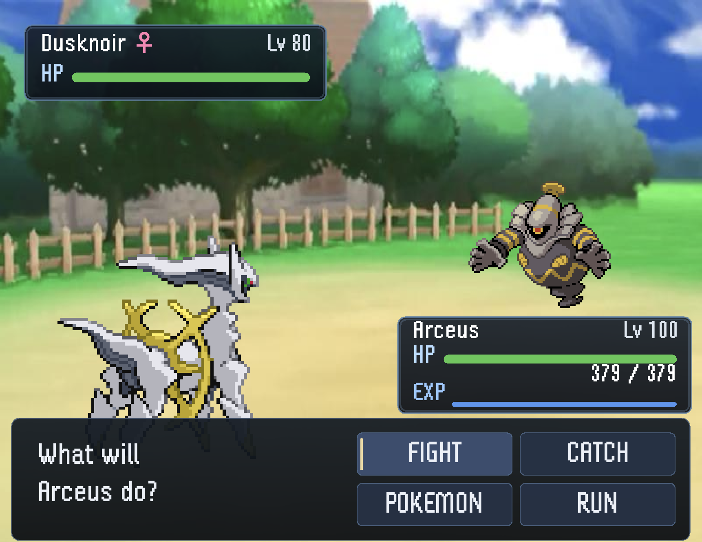
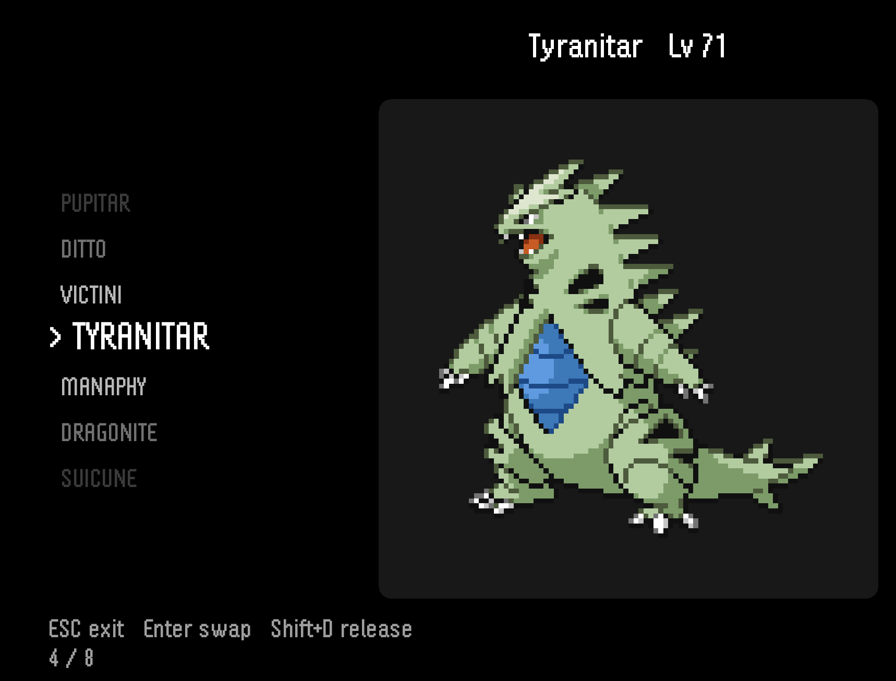

# Pokemon Bronze Brick

## Screenshots

| Title screen | Starter selection |
|---|---|
|  |  |

| Overworld | Wild encounter |
|---|---|
|  |  |

| PC viewer |
|---|
|  |

---

## Game overview

- **Genre:** 2D top-down monster-collector RPG.
- **Premise:** You wake up in Mitis Town, pick a starter from any of the first
  six generations, and walk north through Route 1 / Route 2-3. Wild pokemon
  ambush you from the grass. In the top-right of the map, a mysterious trainer
  named `????` is waiting with a six-pokemon team of level-100 legendaries.
- **Core loop:** rustle grass → catch / KO wild pokemon → grind exp →
  level up → heal at the Pokemon Center → swap moves at the Move Tutor →
  fight stronger spawns → eventually beat `????` → cap your collection by
  catching everything on the way.
- **Target audience:** Pokemon fans who want a small offline sandbox of the
  classic mechanics, plus Java/Swing learners who want a single mid-size 2D
  game to read end-to-end.

---

## Features

### Mechanics

- **Full 18-type matchup chart** with proper dual-type stacking (`2x * 2x = 4x`,
  `0.5 * 0.5 = 0.25x`, immunities zero out).
- **Standard Pokemon stat formula** with base stats, IVs, EVs, and level scaling.
  Stats re-derive on level-up via `Pokemon.recalcStats()`; HP grows by the
  delta so leveling up at 1 HP doesn't leave you fainted.
- **Experience curves** approximated as `growth_max * (level / 100)^3` — exact
  for Fast / Medium Fast / Slow.
- **Catch math** that scales the pokeball bonus from normal-ball strength at
  low levels up to ultra-ball at level 100, plus the classic shake-count
  resolution (0-3 wobbles = break, 4 = caught).
- **Wild-encounter level scaling**: wilds always spawn within `partyMax - 5`
  to `partyMax` (capped at 80). Evolution-stage buckets bias the species pool
  by your strongest mon (base forms early, fully-evolved late).
- **Pseudo-legendary downweighting** (Dratini / Bagon / Gible / etc. lines at
  0.75x weight).
- **Legendary roll**: 2% of bush encounters draw from the legendary/mythical
  pool. Mythicals get their own theme; regular legendaries get another.

### Modes / activities

- **3 save slots** — independent worlds, picked from the title screen.
- **Starter selection** — 18 starters, Gen 1 through Gen 6.
- **Wild encounters** triggered by walking through tall grass on Route 1.
- **Trainer boss battle** — six level-100 legendaries (Darkrai, Groudon,
  Kyogre, Rayquaza, Mewtwo, Arceus) with hand-picked signature movesets. No
  catching, no running. Beat them and you're awarded a level-100 Arceus.
- **Pokemon Center** — Nurse Joy heals your party, lets you browse / release
  PC-stored pokemon.
- **Move Tutor** — teaches species-legal moves; lets you swap into any of your
  current four move slots.
- **Party management** — 2x3 card grid, swap members, view stats / EXP, switch
  during battle (counts as a turn against trainers).
- **Auto-PC overflow** — catching with a full party sends the new pokemon to
  the PC (fully healed).
- **Blackout** — party wipe fades out, shows the "blacked out" line,
  teleports you next to the Pokemon Center, heals everyone.

### Progression systems

- **EXP / level-up** with stat recalc and animated level-up dialogs.
- **Signature moves** force-included on legendaries (e.g., wild Kyogre always
  shows up with Origin Pulse).
- **Species learnsets** (`learnsets.csv`, ~6,000 entries) gate Move Tutor
  options to mainline-accurate move pools.
- **Boss reward**: defeating `????` awards a level-100 Arceus.

### Controls

| Action | Keys |
|---|---|
| Move | `W` `A` `S` `D` / Arrow keys |
| Confirm | `Enter` (primary) / `Z` (some menus) |
| Back / cancel | `Esc` |
| Open party menu | `P` |
| Save (in overworld) | `Shift` + `S` |
| Delete slot (title screen) | `Shift` + `D` |
| Name entry (new game) | Type — `Backspace` to delete, `Enter` to confirm |
| Starter scroll | `Left` / `Right` to scroll, `Up` / `Down` jumps generation |
| Battle action menu | Arrows + `Enter` (2x2: FIGHT / CATCH / POKEMON / RUN) |
| Battle move menu | Arrows + `Enter` to pick a move, `Esc` to back out |

---

## Tech stack

| Layer | Choice |
|---|---|
| Language | Java (no language extensions; works on JDK 8+, tested on 17+) |
| Engine | Hand-rolled `javax.swing.JPanel` game loop at 60 FPS |
| Graphics | `java.awt.Graphics2D` (sprites, gradient panels, alpha overlays) |
| Audio | `javax.sound.sampled.Clip` (one clip per Sound instance) |
| Data | CSVs for pokemon stats, moves, learnsets; plain-text save files |
| Build | `javac` — no Maven / Gradle / dependencies |
| Tests | Plain `public static void main` test classes under `src/tests/` |

---

## Gameplay guide

### Objectives

- Pick a starter, leave Mitis Town, head north.
- Walk through tall grass to find wild pokemon. Catch them, faint them, or run.
- Heal at the Pokemon Center. Tweak movesets at the Move Tutor.
- Find the `????` trainer at `(col=38, row=11)` on Route 2-3 and defeat all
  six of their legendaries.

### Controls (quick reference)

| Context | Keys |
|---|---|
| Walk | Arrows / WASD |
| Save | `Shift+S` (overworld only) |
| Open party | `P` |
| Action menu (battle) | Arrows + `Enter`, `Esc` to cancel in submenus |
| Confirm dialog | `Enter` (or `Z` in dialog boxes) |
| Name entry | Just type, `Backspace` to fix, `Enter` to confirm |

---

## License

This is a non-commercial personal/learning project. **Pokemon, all species
names, sprites, and the audio tracks belong to Nintendo / Game Freak / The
Pokemon Company.** The original Java source code in this repository is
provided as-is for educational reference. Do not redistribute or sell.

---

*"Walk through grass. Throw ball. Don't ask what `????` knows about you."*
